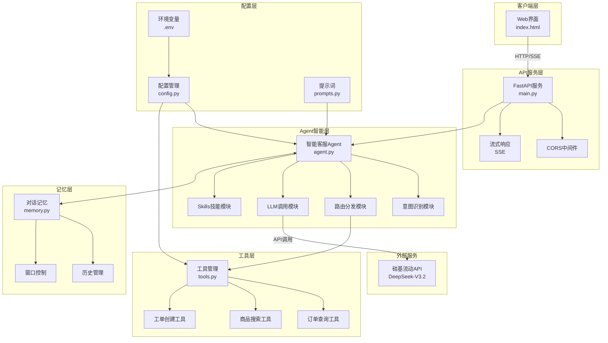
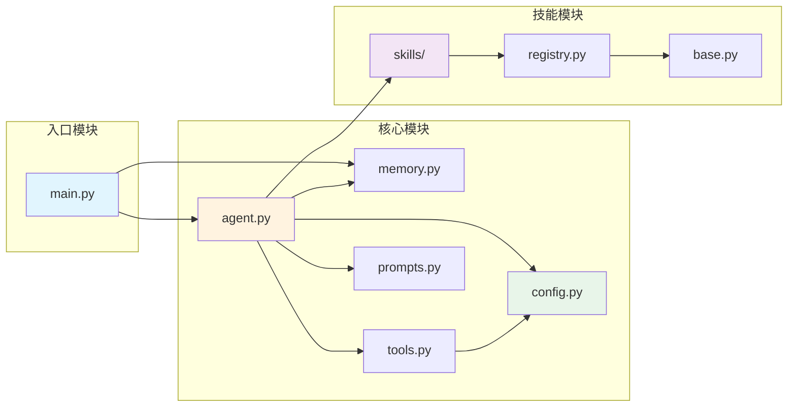
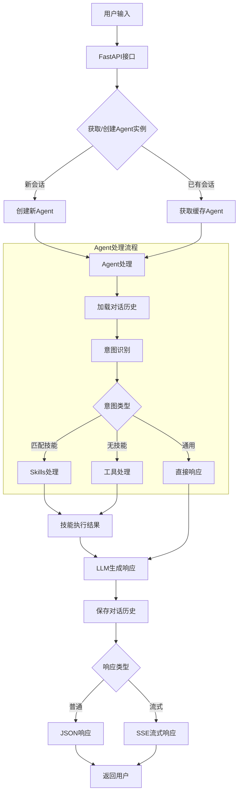
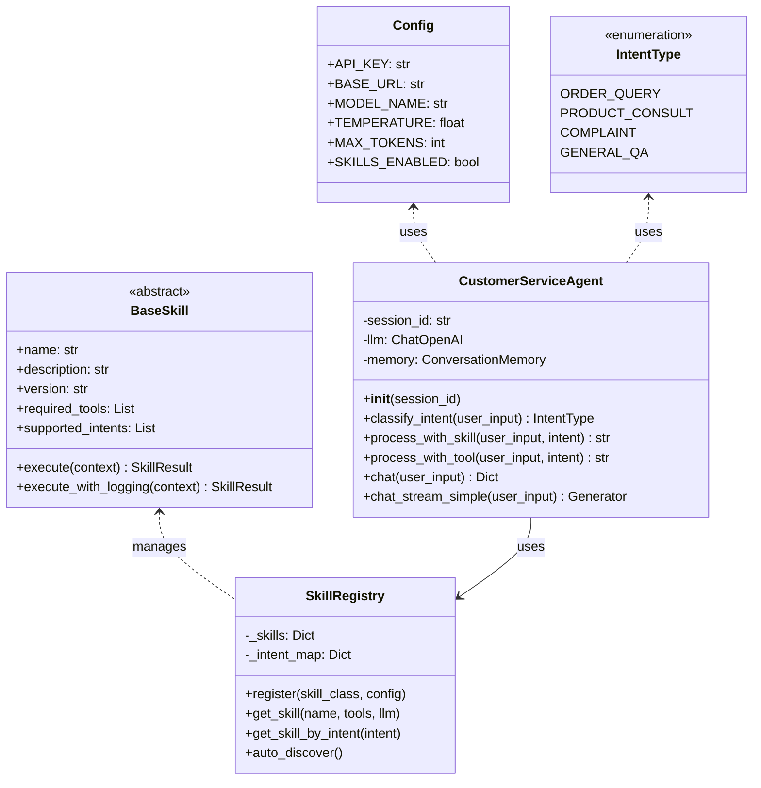

# 架构设计文档

> 本文档整合了系统架构、代码结构、实现决策等内容

---

## 一、系统整体架构



---

## 二、核心模块依赖关系



---

## 三、数据流向图



---

## 四、文件结构

```
project/
├── src/                        # 源代码目录
│   ├── main.py                # [入口] FastAPI应用
│   ├── agent.py               # [核心] 智能Agent
│   ├── config.py              # [配置] 配置和常量
│   ├── tools.py               # [工具] 工具定义
│   ├── memory.py              # [记忆] 对话记忆
│   ├── prompts.py             # [提示词] Prompt模板
│   └── skills/                # [技能] 技能模块
│       ├── __init__.py
│       ├── base.py            # 技能基类
│       ├── registry.py        # 技能注册中心
│       └── implementations/   # 技能实现
│
├── skills/                     # 技能配置目录
│   ├── skills.yaml            # 技能配置文件
│   └── order-assistant/       # 订单助手技能
│       ├── SKILL.md
│       └── scripts/executor.py
│
├── static/                     # 静态资源
│   └── index.html             # Web聊天界面
│
├── spec/                       # 项目文档
│   ├── Me2AI/                 # 需求文档
│   └── AI2AI/                 # 技术文档
│
├── .env                       # 环境变量
├── requirements.txt           # Python依赖
└── README.md                  # 项目说明
```

---

## 五、核心类设计



---

## 六、技术决策记录

### 1. LLM 选择
**决策**: 使用硅基流动的 DeepSeek-V3.2

**原因**:
1. OpenAI 兼容接口，降低迁移成本
2. DeepSeek 中文能力强，性价比高
3. 硅基流动提供稳定的 API 服务

**实现**:
```python
self.llm = ChatOpenAI(
    model="deepseek-ai/DeepSeek-V3.2",
    api_key=Config.API_KEY,
    base_url="https://api.siliconflow.cn/v1",
    request_timeout=120,
    max_retries=1,
)
```

---

### 2. 流式响应实现
**决策**: 使用 Server-Sent Events (SSE)

**原因**:
1. SSE 比 WebSocket 更简单，适合单向数据流
2. 原生 HTTP 协议，无需额外握手
3. FastAPI 原生支持 StreamingResponse

**SSE 格式**:
```
data: {"type": "intent", "intent": "xxx", "intent_name": "xxx"}\n\n
data: {"type": "content", "content": "文本块"}\n\n
data: {"type": "done"}\n\n
```

---

### 3. Skills 技能系统
**决策**: 引入 Skills 作为 Tools 的高级抽象

**设计**:
- 每个技能独立目录，包含 SKILL.md 和执行器
- 支持多步骤操作、专业知识、流式输出
- 通过 skills.yaml 配置管理
- 支持热加载

---

## 七、技术栈

| 层级 | 技术选型 | 用途 |
|------|----------|------|
| 前端 | HTML5 + CSS3 + JavaScript | Web聊天界面（黑科技风格） |
| 后端框架 | FastAPI | 高性能API服务 |
| LLM框架 | LangChain | 工具调用和链式调用 |
| 模型 | DeepSeek-V3.2 | 语言理解与生成 |
| API提供 | 硅基流动 | 模型推理服务 |
| 流式传输 | SSE | 实时响应 |
| 技能系统 | Skills | 高级能力抽象 |

---

*文档更新时间: 2026-03-13*
