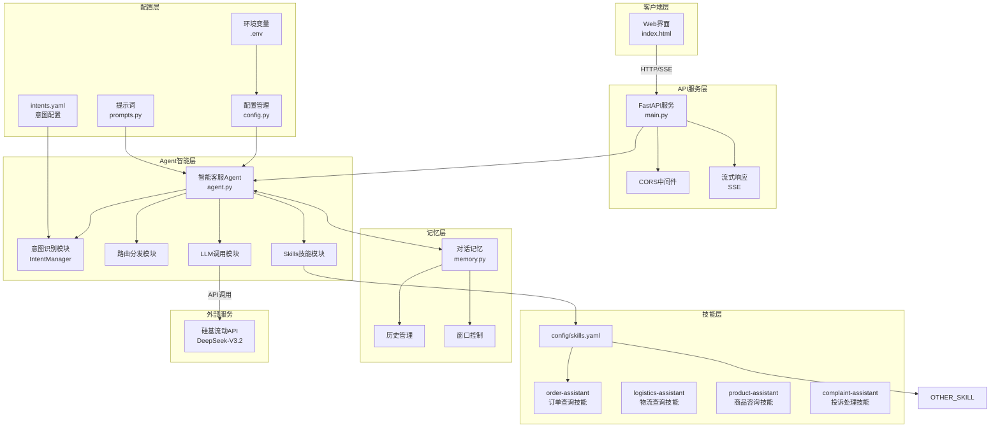
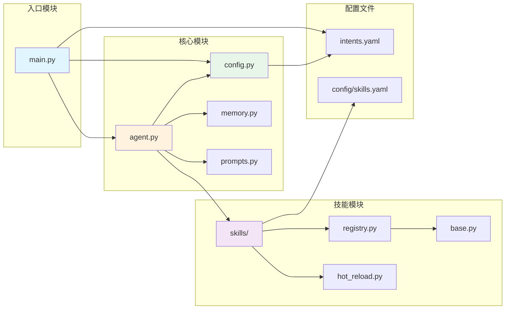
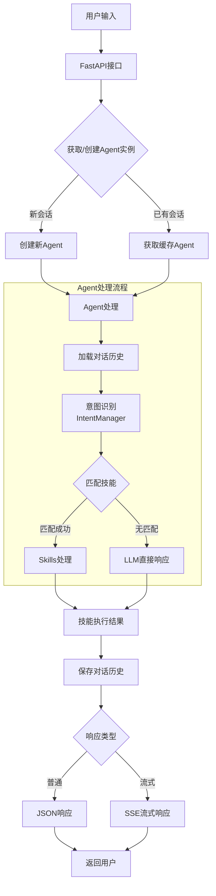
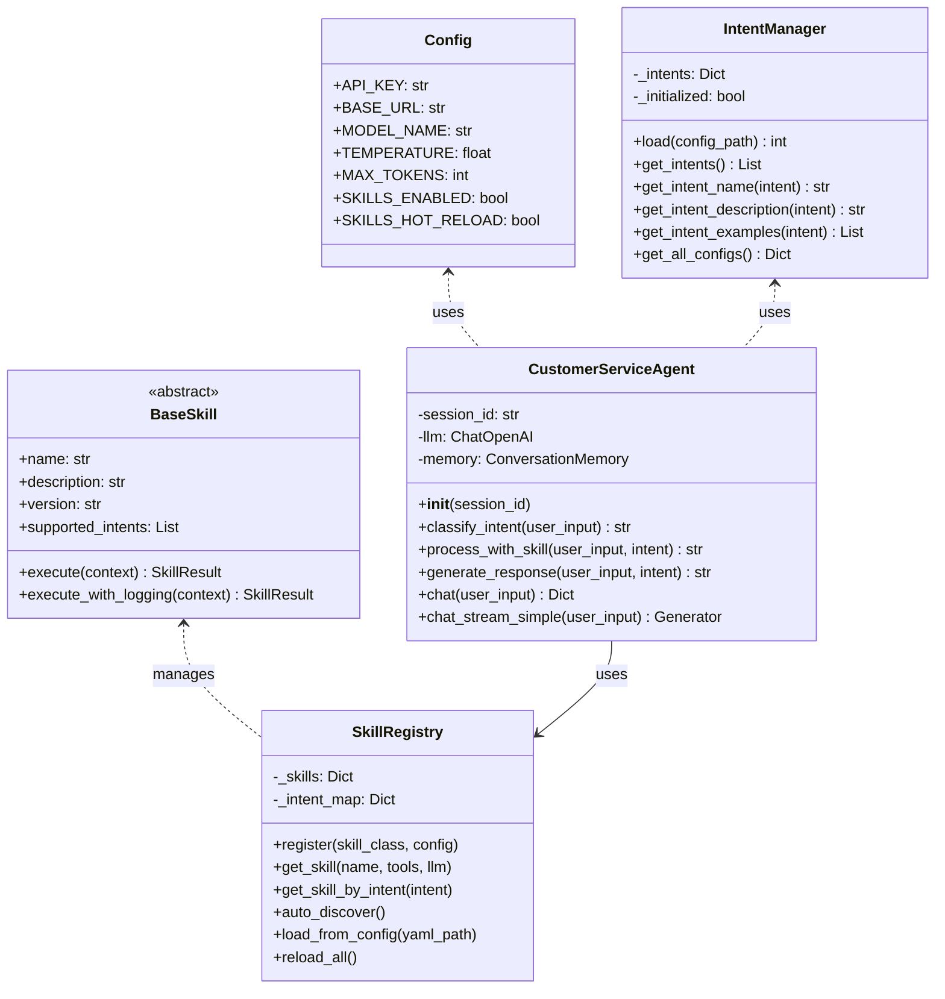
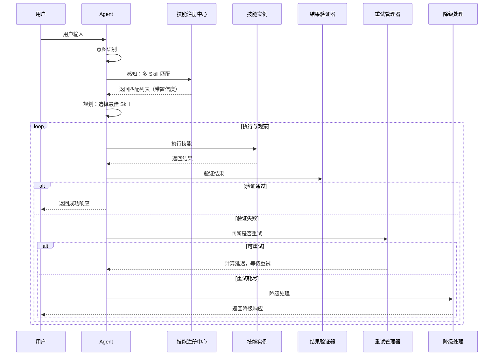

# 架构设计文档

> 本文档整合了系统架构、代码结构、实现决策等内容

---

## 一、系统整体架构



**架构特点**：
- **Skills-Only 架构**：移除独立的 Tools 层，工具逻辑内聚到 Skill 内部
- **二级处理链**：Skills → LLM（无 Tools 中间层）
- **配置化意图**：意图类型通过 `config/intents.yaml` 配置

---

## 二、核心模块依赖关系



---

## 三、数据流向图



**处理链说明**：
1. **意图识别**：基于 `intents.yaml` 配置动态生成 Prompt
2. **Skills 处理**：匹配意图对应的 Skill，执行内聚的工具逻辑
3. **LLM 降级**：无 Skill 匹配时，直接使用 LLM 生成响应

---

## 四、文件结构

```
project/
├── config/                     # 配置目录
│   ├── intents.yaml           # 意图配置（动态加载）
│   └── skills.yaml            # 技能配置文件
│
├── src/                        # 源代码目录
│   ├── main.py                # [入口] FastAPI应用
│   ├── agent.py               # [核心] 智能Agent（Skills-Only架构）
│   ├── config.py              # [配置] 配置和IntentManager
│   ├── memory.py              # [记忆] 对话记忆
│   ├── prompts.py             # [提示词] 动态Prompt模板
│   └── skills/                # [技能] 技能模块
│       ├── __init__.py
│       ├── base.py            # 技能基类
│       ├── registry.py        # 技能注册中心
│       ├── hot_reload.py      # 热加载机制
│       ├── config.py          # 技能配置
│       └── implementations/   # 技能实现
│
├── skills/                     # 技能目录
│   ├── order-assistant/       # 订单查询技能
│   │   ├── SKILL.md
│   │   └── scripts/executor.py
│   ├── logistics-assistant/   # 物流查询技能
│   │   ├── SKILL.md
│   │   └── scripts/executor.py
│   ├── product-assistant/     # 商品咨询技能
│   │   ├── SKILL.md
│   │   └── scripts/executor.py
│   └── complaint-assistant/   # 投诉处理技能
│       ├── SKILL.md
│       └── scripts/executor.py
│
├── static/                     # 静态资源
│   └── index.html             # Web聊天界面
│
├── spec/                       # 项目文档
│   ├── Me2AI/                 # 需求文档（用户维护）
│   │   ├── 功能需求描述.md
│   │   ├── 非功能需求描述.md
│   │   ├── 技术约束.md
│   │   └── 任务规划.md
│   └── AI2AI/                 # 技术文档（AI维护）
│       ├── 架构设计.md
│       ├── 接口规范.md
│       └── Skills模块说明.md
│
├── script/                     # 启动脚本
│   ├── start.bat              # Windows简单启动
│   └── start-web.bat          # Windows完整启动
│
├── .env                       # 环境变量
├── requirements.txt           # Python依赖
└── README.md                  # 项目说明
```

---

## 五、核心类设计



**关键变化**：
- 移除 `IntentType` 枚举，改用 `IntentManager` 动态加载
- 移除 `Tools` 层，工具逻辑内聚到 Skill 内部
- Agent 处理链简化为 Skills → LLM

---

## 六、技术决策记录

### 1. LLM 选择
**决策**: 使用硅基流动的 DeepSeek-V3.2

**原因**:
1. OpenAI 兼容接口，降低迁移成本
2. DeepSeek 中文能力强，性价比高
3. 硅基流动提供稳定的 API 服务

**实现**:
```python
self.llm = ChatOpenAI(
    model="deepseek-ai/DeepSeek-V3.2",
    api_key=Config.API_KEY,
    base_url="https://api.siliconflow.cn/v1",
    request_timeout=120,
    max_retries=1,
)
```

---

### 2. 意图配置化
**决策**: 意图类型通过 YAML 配置文件管理

**原因**:
1. 无需修改代码即可扩展意图
2. 支持丰富的示例引导 LLM
3. 配置与代码分离，维护更清晰

**实现**:
```yaml
# config/intents.yaml
intents:
  order_query:
    name: 订单查询
    description: 查询订单状态、物流信息
    examples:
      - "查询订单 12345678"
      - "我的订单到哪了"
```

---

### 3. Skills-Only 架构
**决策**: 移除独立的 Tools 层，工具逻辑内聚到 Skill 内部

**原因**:
1. 简化处理链，从三级变为二级
2. 工具与 Skill 高度相关，内聚更合理
3. 减少模块间耦合

**处理链对比**:
```
之前：Skills → Tools → LLM（三级）
现在：Skills → LLM（二级）
```

---

### 4. 流式响应实现
**决策**: 使用 Server-Sent Events (SSE)

**原因**:
1. SSE 比 WebSocket 更简单，适合单向数据流
2. 原生 HTTP 协议，无需额外握手
3. FastAPI 原生支持 StreamingResponse

**SSE 格式**:
```
data: {"type": "intent", "intent": "xxx", "intent_name": "xxx"}\n\n
data: {"type": "content", "content": "文本块"}\n\n
data: {"type": "done"}\n\n
```

---

### 5. 热加载机制
**决策**: 使用 watchdog 实现文件监控

**实现**:
- 监控 skills/ 目录变化
- 自动重载修改的技能
- 提供 API 手动重载

---

## 七、技术栈

| 层级 | 技术选型 | 用途 |
|------|----------|------|
| 前端 | HTML5 + CSS3 + JavaScript | Web聊天界面（黑科技风格） |
| 后端框架 | FastAPI | 高性能API服务 |
| LLM框架 | LangChain | 工具调用和链式调用 |
| 模型 | DeepSeek-V3.2 | 语言理解与生成 |
| API提供 | 硅基流动 | 模型推理服务 |
| 流式传输 | SSE | 实时响应 |
| 技能系统 | Skills | 核心能力层（工具内聚） |
| 热加载 | watchdog | 运行时更新 |
| 意图配置 | YAML | 动态意图管理 |

---

## 八、启动流程

```
1. 加载 .env 环境变量
2. 验证配置 (Config.validate)
3. 加载意图配置 (IntentManager.load)
4. 初始化技能系统
   ├── 从 config/skills.yaml 加载配置
   └── 启动热加载监控
5. 启动 FastAPI 服务
6. 注册路由和中间件
7. 开始监听请求
```

---

## 九、Agent 驱动 Skill 执行闭环

### 1. 闭环架构



### 2. 核心组件

| 组件 | 文件 | 职责 |
|------|------|------|
| 元数据解析器 | `resource_loader.py` | 解析 SKILL.md YAML Front Matter |
| 资源加载器 | `resource_loader.py` | 加载 references/ 和 assets/ |
| 结果验证器 | `validators.py` | 验证执行结果格式和质量 |
| 重试管理器 | `retry.py` | 管理重试策略和延迟计算 |
| 反馈生成器 | `feedback.py` | 生成结构化错误反馈 |

### 3. 数据类增强

```python
# 技能匹配结果
@dataclass
class SkillMatch:
    skill_name: str
    confidence: float  # 0.0 - 1.0
    matched_intents: List[str]
    matched_keywords: List[str]
    priority: int

# 验证结果
@dataclass
class ValidationResult:
    is_valid: bool
    errors: List[str]
    score: float  # 质量评分 0-1

# 执行追踪
@dataclass
class ExecutionTrace:
    trace_id: str
    skill_name: str
    status: ExecutionStatus
    attempts: List[ExecutionAttempt]
    final_result: Optional[SkillResult]
    fallback_used: bool
```

### 4. 配置简化

**config/skills.yaml** 只保留 quick_actions 配置：
```yaml
global:
  enabled: true
  hot_reload: true
  default_timeout: 30

quick_actions:
  order-assistant:
    - label: "[ORDER] 订单查询"
      message: "查询订单 12345678"
```

**元数据从 SKILL.md 扫描**：
```yaml
---
name: order-assistant
description: 订单查询服务
priority: 10
intents:
  - order_query
keywords:
  - 订单
  - 查询
retry:
  max_attempts: 3
  strategy: exponential
fallback:
  strategy: llm_assist
---
```

### 5. 技能生命周期

```
1. 感知阶段
   - 扫描 skills/ 目录
   - 解析 SKILL.md 元数据
   - 计算 Skill 置信度

2. 规划阶段
   - 选择最佳 Skill
   - 准备降级方案

3. 执行阶段
   - 加载 references/assets
   - 执行技能逻辑
   - 追踪执行状态

4. 观察阶段
   - 验证结果质量
   - 决定重试/降级

5. 反馈阶段
   - 生成用户友好消息
   - 记录执行日志
```

---

*文档更新时间: 2026-03-16*
